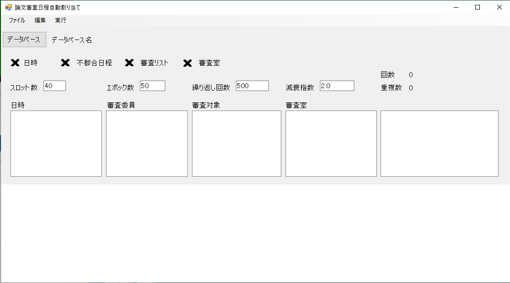

# DefenseAllocator

論文審査などのイベントのスケジューリング最適化ツールです。

## はじめに

たくさんの審査員がたくさんの項目の審査を短期間に行う場合、スケジューリングが大変面倒です。DefenseAllocatorは、その手のものを自動化するツールです。

## 動作環境

Windows （たぶん7以降）で動きます。C#で記述されているので、Monoを使うとLinuxやMacOSで動くかもしれません。
問題点として、Excelワークシートの読み込みに[NPOI](https://github.com/tonyqus/npoi/)を使うので、その移植が必要です。

## 定義

最初に用語の定義をします。ここでは、（元々の対象である）学位論文審査を例とします。

### 学生

審査を受ける人です。学生には、一意に振られた「学籍番号」があることを仮定します。

### 審査員

学生を審査する人です。一般に一人の審査員が複数の学生を審査します。

### スロット

審査を行う日と時間帯の組み合わせです。審査では複数のスロットが定義され、審査をどのスロットに入れるかを考えることになります。

### 会場

審査を行う場所です。

### イベント

「イベント」は、ある特定の人の審査のことです。学生、題目（イベント名）、審査員（複数）からなります。

### 不都合日程

ある特定の審査員が審査を行うことができない日程のことです。

## 使い方

### 準備

最初に、必要な全ての情報を記入したExcelワークシートを用意します。（テスト用日程データ.xlsxを参照）ワークシートには、次のタブをこの順番に用意します。

1. データ入力タブ

   審査員、審査日、時間枠、会場を定義します。キャンパスリストもありますが、使っていません。

2. 学生情報タブ

   通し番号、学籍番号、専攻名（未使用）、氏名、論文タイトル、審査員リストを定義します。審査員は最大５名です。

3. 審査員情報タブ

   審査員の不都合日程を定義します。横に全てのスロットを並べ、列が審査員を表します。審査ができないセルに×を記入します。

4. 会場情報タブ

   会場が使用できない時間を定義するタブですが、現在は使っていません。

### ウィンドウ

プログラムを起動します。ウィンドウは下図の通りです。



エポック数、繰り返し回数、減衰指数は指定が可能ですが、あまり変えても意味がないかもしれません。全体としては、エポック数×繰り返し回数×3×2回の計算を行います。割り当て問題が簡単な場合には、繰り返し回数は少なくても大丈夫です（例えば100回ぐらいでよい）。難しい条件を発見するためには繰り返し回数を多くする必要があります。

### 手順の概要

1. 最初にデータベースを指定します。プログラムは、情報が記載されたExcelワークシートの内容を読んで、それを一旦データベースファイル(SQLite3形式)に格納してから作業を始めます。データベースができれば、あとはそのデータベースだけを参照するので、同じ作業をもう一回やる場合にはExcelからの再読込みは不要です。

2. データベースを指定したら、[ファイル]→[Excelファイルを開く] でExcelワークシートを指定し、読み込みます。

2.  データベースの準備ができると、「日時」「不都合日程」「審査リスト」「審査室」の項目のサインが×から☑に変わり、割り当て実行可能になります。

3. [実行]→[割り当て実行] で実行が開始されます。

  * 「回数」には全体としての繰り返し回数（最大はエポック数×繰り返し回数）が表示されます。
  * 「重複数」には、現在割り当てがうまくいっていないイベントの個数が表示されます。これが０になるのが目標ですが、場合によって0にならないこともあります。
  * ウィンドウ下にはグラフが表示されます。このグラフは現在の割り当ての良さを表していて、小さいほど良い割り当てになります。
  * 割り当ては2つの段階からなっています。第１段階では、全てのイベントのスロットと会場をランダムに入れ替えながら、割り当てを改善していきます。これをエポック数×繰り返し回数だけ行いますが、最後まで実行して満足な割り当てが得られない場合には、この作業を最大３回繰り返します。第２段階では、イベントのスロットを固定し、会場だけの入れ替えを行います。繰り返し回数は第１段階と同様です。
  * 割り当てを行う前に、割り当てることが不可能なイベントが発見されます。これは、すべての審査員に共通な空きスロットが見つからなかった場合です。この組み合わせについて、impossible.csvというデータを出力します。
  * 最終的な割り当て結果は output.csv という名前で出力されます。output.csv はスロットと会場の２次元の表になっています。最終的に調整がつかなかった審査員がいた場合には、「重複」というタイトルの列に名前が表示されます。
  * すべての審査員・学生の組み合わせがどう割り当てられたかの情報が alllist.csv というデータとして出力されます。


